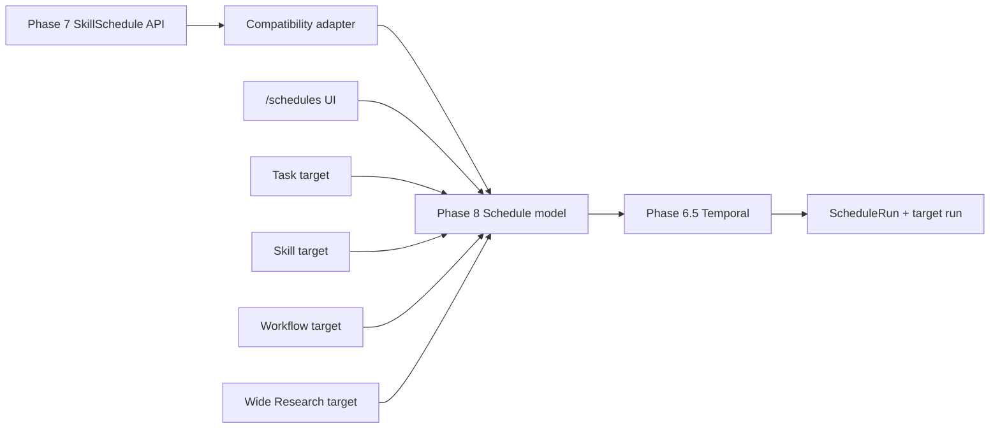

# Phase 8 Spec: Unified Schedules Platform

## Status

Stage 0 specification draft. No implementation is included in this commit.

Phase 8 ships the unified Schedules platform. It supersedes Phase 7's narrow
Skill scheduling surface and expands durable scheduling to normal tasks, Skills,
multi-step workflows, and Wide Research. It reuses the Temporal infrastructure
from Phase 6.5 and does not introduce another scheduler, job queue, BullMQ
stack, cron daemon, or `setInterval` loop.

Do not treat this document as SIGNOFF. Phase 8 still needs implementation,
Codex live smokes, manual audit, user signoff, and the phase merge gate.

## Branching and Coordination

Phase 8 work uses branch `phase-8/schedules`, cut from `phase-7/skills` after
the Phase 7 built-in Skill execution fixes landed. This is intentional because
Phase 8 must migrate the Phase 7 `SkillSchedule` implementation rather than
design against an older branch that lacks the Skills foundation.

Parallel branch boundaries:

- Do not touch `phase-6/integrations`.
- Do not touch `phase-6.5/agent-foundation`.
- Do not touch `phase-7/skills` after cutting this branch unless the user
  explicitly asks for a Phase 7 fix.
- If Phase 7 changes while Phase 8 is in progress, rebase or cherry-pick only
  after reviewing the concrete diff and preserving the Phase 8 migration plan.

## References Checked

Stage 0 drafting checked:

- `AGENTS.md`
- `docs/codex-context/FINAL_AGENTS.md`
- `docs/phase-7/PHASE_7_SPEC.md`
- Current Phase 7 Skill scheduling code in `apps/api/src/skills/schedules.ts`
- Current Phase 7 Skill workflow code in `apps/api/src/skills/workflows.ts`
- Current Phase 6.5/7 Temporal helpers in `apps/api/src/temporal/`
- Shared API types in `packages/shared/src/types.ts`
- Existing `/schedules` top-level nav route presence
- Existing Skills UI route conventions and Settings UI patterns

The Phase 6.5 spec file is not present on the Phase 7 branch snapshot used for
this branch, but the implemented Temporal code and `AGENTS.md` stack-of-record
confirm Temporal self-hosted is the locked scheduler foundation.

## Ground Truth Decisions

- Phase 8 supersedes Phase 7 scheduling.
- Phase 7 `SkillSchedule` migrates to a unified `Schedule` model.
- Phase 7 scheduling endpoints remain backward-compatible:
  - `POST /api/skills/:id/schedules`
  - `GET /api/skill-schedules`
  - `PUT /api/skill-schedules/:id`
  - `DELETE /api/skill-schedules/:id`
  - `POST /api/skill-schedules/:id/run-now`
- Legacy Phase 7 endpoints read and write the new `Schedule` model.
- Temporal from Phase 6.5 is reused. No duplicate Temporal service.
- No BullMQ.
- No custom scheduler loop.
- Schedules can target:
  - Tasks
  - Skills
  - Workflow Templates / multi-step workflows
  - Wide Research
- Natural language schedule parsing is in scope.
- Schedule from completed task is in scope.
- Twelve built-in schedule templates ship in scope.
- Backfill is in scope.
- Test-run mode is in scope.
- Change detection and monitoring mode are in scope.
- Approval handling for unattended runs is in scope.
- Integration health checks happen before every run.
- Quotas and cost limits are in scope.
- Schedule history with full `ScheduleRun` records is in scope.
- Team-scoped schedule libraries are out of scope.
- Paid marketplace, buying, selling, public listings, revenue sharing, and
  checkout are out of scope.

## Product Principles

1. A schedule is a durable promise, not a UI reminder.
2. Scheduled runs produce the same inspectable artifacts, traces, sources,
   action logs, and failure memory as manually triggered runs.
3. Unattended runs must be more conservative than interactive runs.
4. Sensitive writes become drafts or wait for approval; they do not silently
   execute because a schedule fired.
5. Scheduling UX is visual and natural-language-friendly. Users should not need
   to know cron syntax.
6. Temporal owns durability, retries, overlap policy, and visibility.
7. The database owns Handle product state, auditability, quotas, user policy,
   and legacy endpoint compatibility.
8. Every run links back to the originating schedule and, when applicable, the
   originating task, Skill, workflow, or Wide Research run.
9. A test run must prove the schedule can execute without performing sensitive
   external side effects.
10. Missed runs and overlapping runs follow explicit user-visible policy.

## Non-Goals

- Paid schedule marketplace.
- Team-scoped schedule libraries.
- Public templates marketplace.
- A second scheduler service.
- A custom event store.
- Custom OAuth or direct provider token storage.
- Custom memory store.
- Native macOS notification channel. Tauri/macOS native notifications remain
  Phase 11.
- Byte-identical replay guarantees.
- Auto-sending emails, Slack messages, or destructive integration actions from
  unattended schedules without approval.

## Reconciliation: Phase 7 vs Phase 8

Phase 7 keeps:

- Skill package format.
- Skill registry and built-in Skills.
- Skill run execution.
- Skill artifacts and traces.
- Multi-Skill workflow graph execution.
- The existing Skill run UI and Skill workflow builder.
- Legacy Skill schedule API routes as compatibility wrappers.

Phase 8 owns:

- All durable schedule records.
- All schedule creation, editing, archive/delete, pause/resume, run-now,
  test-run, and backfill behavior.
- Natural-language schedule parsing.
- Schedule templates.
- Schedule run history.
- Schedule overlap and catchup policy.
- Schedule quotas and cost ceilings.
- Schedule integration-health checks.
- Waiting-for-approval and waiting-for-integration states.
- Unified schedule UI at `/schedules`.



## Migration Plan

Stage 1 migrates Phase 7 scheduling without breaking callers.

Database migration:

1. Add new `Schedule`, `ScheduleRun`, `ScheduleTemplate`, and support enums.
2. Backfill each existing `SkillSchedule` row into `Schedule`:
   - `targetType = SKILL`
   - `targetRef = { skillId }`
   - `input = SkillSchedule.inputs`
   - `name`, `enabled`, `cronExpression`, `runAt`, `timezone`,
     `temporalScheduleId`, `lastRunAt`, `nextRunAt`, `projectId`, `userId`
     copied directly.
   - `legacySkillScheduleId = SkillSchedule.id`
3. Keep `SkillSchedule` table for one phase as a compatibility view/source if
   needed, but all new writes go to `Schedule`.
4. Add a unique index on `Schedule.legacySkillScheduleId` when present.
5. Mark old `SkillSchedule` code paths as adapters only.

API compatibility:

- `GET /api/skill-schedules` returns schedules where `targetType = SKILL`,
  serialized as `SkillScheduleSummary`.
- `POST /api/skills/:id/schedules` creates a `Schedule` with `targetType =
  SKILL`, then returns the legacy shape.
- `PUT /api/skill-schedules/:id` updates the matching `Schedule`.
- `DELETE /api/skill-schedules/:id` archives the matching `Schedule` and
  removes/pauses the Temporal schedule.
- `POST /api/skill-schedules/:id/run-now` creates a `ScheduleRun` and executes
  through the unified Schedule Manager.

Temporal migration:

- Existing `handle-skill-schedule-<id>` Temporal schedule IDs remain accepted.
- New IDs use `handle-schedule-<scheduleId>`.
- During migration, if an old Temporal schedule exists, Stage 1 either updates
  it in place or deletes/recreates it with the new ID. The migration records the
  final ID in `Schedule.temporalScheduleId`.

Rollback:

- Because this is pre-production dev, rollback can restore from Prisma migration
  history and the local database snapshot taken before migration.
- Before applying Stage 1 migration locally, create a timestamped DB dump or
  Prisma migration reset note in the handoff.

## Architecture Overview

Phase 8 adds these subsystems:

- `ScheduleManager`
  - Canonical create/update/delete/run-now/test-run/backfill API.
  - Validates target, policy, integration health, quotas, and Temporal state.
- `ScheduleParser`
  - Converts natural-language schedule text to structured recurrence.
  - Returns parse confidence and alternatives.
- `NextRunPreview`
  - Computes upcoming run times for visual UI preview.
  - Uses timezone and catchup/overlap policy.
- `TemporalScheduleService`
  - Thin wrapper around existing Temporal client.
  - Upserts, pauses, resumes, deletes, describes, and triggers schedules.
- `ScheduledRunWorkflow`
  - Temporal workflow entrypoint for all scheduled targets.
  - Calls deterministic activities for database and integration work.
- `ScheduleActivities`
  - Health check integrations.
  - Check quota/cost limits.
  - Create `ScheduleRun`.
  - Execute target run.
  - Persist artifacts/sources/traces.
  - Dispatch notifications.
  - Record action log/failure memory.
- `ScheduleTemplates`
  - Built-in template catalog and instantiation helpers.
- `/schedules` UI
  - List, create, detail, run history, approvals, integration waits, and
    backfill flows.

Code locations:

```text
apps/api/src/schedules/
  manager.ts
  parser.ts
  preview.ts
  temporalScheduleService.ts
  runPolicy.ts
  templates.ts
  serializer.ts
  quotas.ts
  healthChecks.ts
  changeDetection.ts
  legacySkillScheduleAdapter.ts

apps/api/src/temporal/workflows/scheduledRunWorkflow.ts
apps/api/src/temporal/scheduleActivities.ts
apps/api/src/routes/schedules.ts

apps/web/app/(workspace)/schedules/
apps/web/components/schedules/
apps/web/lib/schedules.ts

scripts/manual-audit/phase8-schedules.md
scripts/smoke/schedules-*.mjs
```

## Core Concepts

### Target Types

```typescript
type ScheduleTargetType =
  | "TASK"
  | "SKILL"
  | "WORKFLOW"
  | "WIDE_RESEARCH";
```

Target refs:

```typescript
type ScheduleTargetRef =
  | { type: "TASK"; taskTemplate: ScheduledTaskTemplate }
  | { type: "SKILL"; skillId: string }
  | { type: "WORKFLOW"; workflowId: string }
  | { type: "WIDE_RESEARCH"; researchTemplate: WideResearchTemplate };
```

### Schedule Timing

```typescript
type ScheduleTiming =
  | { kind: "once"; runAt: string; timezone: string }
  | { kind: "recurring"; rrule?: string; cronExpression?: string; timezone: string }
  | { kind: "monitor"; cadence: string; timezone: string; changeDetection: ChangeDetectionPolicy };
```

Cron is allowed as an advanced representation, but the UI should prefer visual
frequency controls and natural language parsing.

### Run Policy

```typescript
interface ScheduleRunPolicy {
  overlap: "skip" | "buffer_one" | "buffer_all" | "cancel_other" | "terminate_other" | "allow_all";
  catchup: "skip_missed" | "run_latest" | "run_all_with_limit";
  maxCatchupRuns?: number;
  approval: "drafts_only" | "ask_each_run" | "use_project_permission";
  testRunMode?: boolean;
  maxCostUsdPerRun?: number;
  maxRunsPerDay?: number;
  notifyOnSuccess?: boolean;
  notifyOnFailure?: boolean;
  notifyOnApprovalNeeded?: boolean;
  notifyOnChange?: boolean;
}
```

Default policy:

- `overlap = skip`
- `catchup = run_latest`
- `approval = drafts_only`
- `maxCatchupRuns = 3`
- `testRunMode = false`
- Writes that send or mutate external systems wait for approval unless the user
  explicitly preapproves a narrow action and the global Permission policy allows
  it.
- Destructive actions always wait for approval.

### Run Status

```typescript
type ScheduleRunStatus =
  | "QUEUED"
  | "RUNNING"
  | "WAITING_FOR_APPROVAL"
  | "WAITING_FOR_INTEGRATION"
  | "COMPLETED"
  | "FAILED"
  | "CANCELLED"
  | "SKIPPED"
  | "TEST_PASSED"
  | "TEST_FAILED";
```

## Database Schema

Stage 1 adds:

```prisma
enum ScheduleTargetType {
  TASK
  SKILL
  WORKFLOW
  WIDE_RESEARCH
}

enum ScheduleStatus {
  ENABLED
  DISABLED
  PAUSED
  ARCHIVED
  ERROR
  WAITING_FOR_INTEGRATION
}

enum ScheduleRunStatus {
  QUEUED
  RUNNING
  WAITING_FOR_APPROVAL
  WAITING_FOR_INTEGRATION
  COMPLETED
  FAILED
  CANCELLED
  SKIPPED
  TEST_PASSED
  TEST_FAILED
}

enum ScheduleOverlapPolicy {
  SKIP
  BUFFER_ONE
  BUFFER_ALL
  CANCEL_OTHER
  TERMINATE_OTHER
  ALLOW_ALL
}

enum ScheduleCatchupPolicy {
  SKIP_MISSED
  RUN_LATEST
  RUN_ALL_WITH_LIMIT
}

model Schedule {
  id                    String                @id @default(cuid())
  userId                String
  projectId             String?
  name                  String
  description           String?
  status                ScheduleStatus        @default(DISABLED)
  targetType            ScheduleTargetType
  targetRef             Json                  @default("{}")
  input                 Json                  @default("{}")
  timing                Json                  @default("{}")
  cronExpression        String?
  rrule                 String?
  runAt                 DateTime?
  timezone              String
  overlapPolicy         ScheduleOverlapPolicy @default(SKIP)
  catchupPolicy         ScheduleCatchupPolicy @default(RUN_LATEST)
  runPolicy             Json                  @default("{}")
  approvalPolicy        Json                  @default("{}")
  integrationPolicy     Json                  @default("{}")
  quotaPolicy           Json                  @default("{}")
  changeDetectionPolicy Json                  @default("{}")
  notificationPolicy    Json                  @default("{}")
  temporalScheduleId    String?
  legacySkillScheduleId String?               @unique
  sourceTaskId          String?
  sourceConversationId  String?
  lastRunAt             DateTime?
  nextRunAt             DateTime?
  lastStatus            ScheduleRunStatus?
  lastErrorCode         String?
  lastErrorMessage      String?
  archivedAt            DateTime?
  createdAt             DateTime              @default(now())
  updatedAt             DateTime              @updatedAt
  runs                  ScheduleRun[]

  @@index([userId, status, nextRunAt])
  @@index([projectId, status])
  @@index([targetType, createdAt])
  @@index([temporalScheduleId])
}

model ScheduleRun {
  id                 String            @id @default(cuid())
  scheduleId         String
  schedule           Schedule          @relation(fields: [scheduleId], references: [id], onDelete: Cascade)
  userId             String
  projectId          String?
  targetType         ScheduleTargetType
  targetRunId        String?
  agentRunId         String?
  skillRunId         String?
  workflowRunId      String?
  temporalWorkflowId String?
  temporalRunId      String?
  status             ScheduleRunStatus @default(QUEUED)
  scheduledFor       DateTime?
  startedAt          DateTime?
  completedAt        DateTime?
  durationMs         Int?
  inputSnapshot      Json              @default("{}")
  outputSummary      String?
  artifactRefs       Json              @default("[]")
  sourceRefs         Json              @default("[]")
  traceRefs          Json              @default("[]")
  costUsd            Decimal?          @db.Decimal(10, 4)
  skippedReason      String?
  errorCode          String?
  errorMessage       String?
  approvalId         String?
  integrationId      String?
  testMode           Boolean           @default(false)
  changeDetected     Boolean?
  changeSummary      String?
  createdAt          DateTime          @default(now())
  updatedAt          DateTime          @updatedAt

  @@index([scheduleId, createdAt])
  @@index([userId, status, createdAt])
  @@index([targetRunId])
}

model ScheduleTemplate {
  id              String   @id
  name            String
  description     String
  category        String
  targetType      ScheduleTargetType
  defaultTiming   Json     @default("{}")
  defaultTarget   Json     @default("{}")
  defaultInput    Json     @default("{}")
  defaultPolicy   Json     @default("{}")
  requiredConnectors String[] @default([])
  createdAt       DateTime @default(now())
  updatedAt       DateTime @updatedAt
}
```

If Phase 7 `SkillSchedule` remains in the schema during migration, it must be
documented as legacy compatibility only.

## Schedule Parser

`ScheduleParser` accepts:

- Natural language: "every Monday at 9am"
- Structured form fields from the UI.
- Existing cron expressions from Phase 7.
- "Schedule this run weekly" from a completed task.

Output:

```typescript
interface ParsedSchedule {
  confidence: number;
  timing: ScheduleTiming;
  humanLabel: string;
  alternatives: Array<{ label: string; timing: ScheduleTiming }>;
  warnings: string[];
}
```

Implementation:

- Prefer deterministic parsing for common patterns:
  - every day at 9am
  - weekdays at 8:30
  - every Monday
  - first day of month
  - every 2 hours
  - on May 20 at noon
- Use the configured LLM only for ambiguous natural-language input after
  deterministic parsing fails.
- The LLM parser returns strict JSON and never executes a schedule.
- UI shows the parsed result and requires explicit user confirmation.

## Next Run Preview

Every create/edit form shows:

- Human label: "Weekdays at 9:00 AM America/Chicago"
- Next 3 runs.
- Catchup behavior.
- Overlap behavior.
- Whether sensitive writes will wait for approval.

Preview service:

- Uses schedule timing, timezone, catchup policy, and disabled dates.
- Does not create Temporal schedules.
- Handles invalid timezone and daylight savings transitions.

## Temporal Integration

Temporal service is the single durable scheduler.

`TemporalScheduleService` responsibilities:

- `upsertSchedule(schedule)`
- `pauseSchedule(scheduleId)`
- `resumeSchedule(scheduleId)`
- `deleteSchedule(scheduleId)`
- `describeSchedule(scheduleId)`
- `triggerNow(scheduleId, options)`
- `backfill(scheduleId, range, options)`

Temporal mapping:

- Schedule ID: `handle-schedule-<scheduleId>`
- Workflow type: `scheduledRunWorkflow`
- Task queue: existing `DEFAULT_TEMPORAL_TASK_QUEUE`
- Namespace/address/settings: existing Phase 6.5 Temporal settings.

Overlap mapping:

- `skip` -> Temporal `SKIP`
- `buffer_one` -> Temporal `BUFFER_ONE`
- `buffer_all` -> Temporal `BUFFER_ALL`
- `cancel_other` -> Temporal `CANCEL_OTHER`
- `terminate_other` -> Temporal `TERMINATE_OTHER`
- `allow_all` -> Temporal `ALLOW_ALL`

Temporal workflows must be deterministic. Any database access, integration
health checks, LLM calls, web search, task creation, notifications, action log,
or memory writes happen in activities.

## Scheduled Run Workflow

Workflow input:

```typescript
interface ScheduledRunWorkflowInput {
  scheduleId: string;
  scheduledFor?: string;
  runMode: "normal" | "test" | "backfill" | "run_now";
  backfillWindow?: { start: string; end: string };
}
```

Workflow outline:

1. Create or load `ScheduleRun`.
2. Check schedule status.
3. Apply overlap/catchup decision.
4. Check integration health.
5. Check quotas and cost ceilings.
6. Resolve target.
7. If test mode, execute dry-run path and block sensitive writes.
8. Execute target:
   - Task -> create normal task/agent run.
   - Skill -> create `SkillRun`.
   - Workflow -> create workflow run.
   - Wide Research -> create research task/Skill run using wide runtime.
9. Persist artifacts, source refs, trace refs, cost, and output summary.
10. Dispatch notifications according to policy.
11. Record action log.
12. Record failure memory when failure is reusable.
13. Update `Schedule.lastRunAt`, `Schedule.nextRunAt`, and last status.

## Target Execution

### Scheduled Tasks

A scheduled task is a stored goal plus execution preferences:

```typescript
interface ScheduledTaskTemplate {
  goal: string;
  projectId?: string;
  defaultProvider?: string;
  defaultModel?: string;
  backend?: "local" | "e2b";
  memoryEnabled?: boolean;
  integrationContext?: Record<string, unknown>;
}
```

Runs create normal conversation/task records where possible, so the user can
open the run in the standard workspace.

### Scheduled Skills

Scheduled Skills reuse Phase 7 `runSkill` with trigger `SCHEDULED`.

Legacy Phase 7 Skill schedules are adapters over this target.

### Scheduled Workflows

Scheduled workflows reuse Phase 6.5 workflow templates and Phase 7 multi-Skill
workflow graph execution. A run stores both a `ScheduleRun` and the underlying
workflow run ID.

### Scheduled Wide Research

Wide Research schedules execute a research template:

- Query/topic.
- Source breadth.
- Required citations.
- Max source count.
- Output artifact type.
- Change detection policy if monitoring.

## Approval Policy

Unattended schedules are conservative.

Rules:

- Destructive actions always wait for approval.
- Sending emails, Slack messages, Notion updates, GitHub comments, Linear
  changes, Vercel deployments, Cloudflare changes, or filesystem host actions
  require approval unless the action is converted into a draft artifact.
- Default unattended behavior is drafts-only.
- If the user preapproves a narrow action, the preapproval record must specify:
  - connector
  - tool/action
  - target constraints
  - max run count or expiry
  - schedule ID
  - redacted preview text
- Forbidden patterns still deny regardless of preapproval.
- Approval requests from schedules surface in the normal Approvals UI and the
  schedule detail page.

Waiting-for-approval state:

- `ScheduleRun.status = WAITING_FOR_APPROVAL`
- Task/Skill/workflow trace shows the blocked action.
- Notification is sent if enabled.
- User can approve, deny, or edit generated draft.

## Integration Health Checks

Before each run:

- Verify required connectors exist.
- Verify selected account/default account is connected.
- Verify Nango connection is valid.
- Verify local connectors such as Obsidian vault path are reachable.
- Verify required scopes/capabilities for planned actions.
- Verify rate-limit state when available.

If health fails:

- `ScheduleRun.status = WAITING_FOR_INTEGRATION` for recoverable auth or setup.
- `ScheduleRun.status = FAILED` for non-recoverable target config errors.
- UI shows the connector and action needed: reconnect, choose account, change
  vault path, or edit schedule.
- Notification can be sent.
- Failure memory records a redacted reusable lesson.

## Quotas and Cost Limits

Phase 8 adds user-visible limits:

- Max runs per day per schedule.
- Max runs per day per user.
- Max cost per run.
- Max cost per day.
- Max backfill runs per request.
- Max concurrent schedule runs.

Quota checks run before target execution and after target execution cost
calculation. Exceeded quotas produce typed skipped/failed states, not silent
non-execution.

## Backfill

Backfill lets a user run a schedule for past dates.

UI:

- Date range picker.
- Preview count.
- Cost estimate.
- Test-run-first option.
- Confirmation copy for side effects.

Rules:

- Backfill defaults to test mode.
- Sensitive writes become drafts or wait for approval.
- Backfill obeys max run count.
- Each generated run has `runMode = backfill` and `scheduledFor` set to the
  historical occurrence.

## Test Run Mode

Test run validates a schedule without sensitive side effects.

Behavior:

- Reads may run.
- Web search may run.
- LLM synthesis may run.
- Draft artifacts may be created.
- External writes are blocked or converted to drafts.
- Action log records `schedule_test_run`.
- `ScheduleRun.status` is `TEST_PASSED` or `TEST_FAILED`.

## Change Detection / Monitoring

Monitoring schedules run on cadence and notify only when changes meet a policy.

Policy examples:

- Notify if search results include new pages.
- Notify if a GitHub issue count changes above threshold.
- Notify if a Notion database row matching filter appears.
- Notify if competitor page content changes.

Change state:

- Store fingerprints in `Schedule.changeDetectionPolicy` or a future
  `ScheduleChangeState` table if the JSON grows too large.
- Use redacted source metadata and hashes, not raw document bodies.
- `ScheduleRun.changeDetected` and `changeSummary` drive UI and notifications.

## Notifications

Phase 8 reuses Phase 6.5 Settings -> Notifications.

Events:

- schedule run completed
- schedule run failed
- schedule run skipped
- approval needed
- integration action needed
- change detected
- quota exceeded

Notifications include schedule name, target, status, run link, and redacted
summary. They never include secrets, raw email bodies, or private document
contents.

## Action Log and Failure Memory

Structured audit log entries:

- `schedule_created`
- `schedule_updated`
- `schedule_deleted`
- `schedule_enabled`
- `schedule_disabled`
- `schedule_run_started`
- `schedule_run_completed`
- `schedule_run_failed`
- `schedule_run_skipped`
- `schedule_backfill_started`
- `schedule_backfill_completed`
- `schedule_test_run_completed`
- `schedule_approval_needed`
- `schedule_integration_wait`

Each entry is JSON Lines in `~/Library/Logs/Handle/audit.log` with sensitive
payloads redacted.

Failure memory entries:

- Integration unavailable.
- Approval denied repeatedly.
- Quota exceeded.
- Schedule parser ambiguity.
- Target run failed with reusable root cause.
- Notification dispatch failed.

## API Surface

### Unified Schedules

- `GET /api/schedules`
- `POST /api/schedules`
- `GET /api/schedules/:id`
- `PUT /api/schedules/:id`
- `DELETE /api/schedules/:id`
- `POST /api/schedules/:id/enable`
- `POST /api/schedules/:id/disable`
- `POST /api/schedules/:id/run-now`
- `POST /api/schedules/:id/test-run`
- `POST /api/schedules/:id/backfill`
- `GET /api/schedules/:id/runs`
- `GET /api/schedule-runs/:id`
- `POST /api/schedule-runs/:id/cancel`
- `POST /api/schedule-runs/:id/approve`
- `POST /api/schedule-runs/:id/retry`

### Helpers

- `POST /api/schedules/parse`
- `POST /api/schedules/preview`
- `GET /api/schedule-templates`
- `POST /api/schedule-templates/:id/instantiate`
- `POST /api/tasks/:id/schedule`

### Legacy Skill Schedule Compatibility

- `GET /api/skill-schedules`
- `POST /api/skills/:id/schedules`
- `PUT /api/skill-schedules/:id`
- `DELETE /api/skill-schedules/:id`
- `POST /api/skill-schedules/:id/run-now`

These endpoints call `legacySkillScheduleAdapter.ts`.

## UI Surface

### `/schedules`

Top-level page:

- Tabs: All, Tasks, Skills, Workflows, Wide Research, Templates, History.
- Search by name, target, output, status.
- Filters: status, project, connector, target type, next run, last run, errors.
- Cards/table rows show:
  - name
  - target type
  - schedule label
  - next run
  - last run status
  - enabled/paused status
  - required integrations
  - quick actions: Run now, Test, Pause/Resume, Edit.

### Create Schedule

Wizard:

1. Choose target type.
2. Choose target:
   - Task prompt.
   - Skill and input slots.
   - Workflow template and inputs.
   - Wide Research topic and depth.
3. Choose timing:
   - Natural language field.
   - Visual frequency builder.
   - Advanced cron.
4. Review next runs.
5. Choose run policy:
   - overlap
   - catchup
   - approval
   - quotas
   - notifications
6. Test run.
7. Enable.

### Schedule Detail

Sections:

- Overview and status.
- Timing and next runs.
- Target details.
- Required integrations and health.
- Run policy.
- Approval policy.
- Notification policy.
- Quotas and recent cost.
- Recent runs.
- Artifacts and source links from latest run.
- Error panel with recovery actions.

### Schedule Run Page

Route: `/schedule-runs/:id`.

Displays:

- status timeline
- scheduled time
- actual start/end
- target run links
- artifacts
- sources
- trace
- approvals
- integration health result
- cost
- error details

### Schedule From Task

Completed task UI adds "Schedule this" action.

Flow:

- Pre-fills target type `TASK`.
- Summarizes the completed task goal and inputs.
- User edits prompt/template.
- User chooses timing/policy.
- Test run recommended before enabling.

### Waiting States

Waiting for approval:

- Banner on schedule detail.
- Row badge on `/schedules`.
- Link to approval modal.
- Notification if enabled.

Waiting for integration:

- Banner with connector and account.
- Reconnect/setup action.
- Run remains paused until fixed or user skips.

## Built-In Schedule Templates

Phase 8 ships twelve templates:

1. Daily News Digest
2. Weekly Competitor Tracking
3. Monthly Company Research Refresh
4. Daily Inbox Digest
5. Weekly PR Review Summary
6. Release Notes Digest
7. Notion Workspace Weekly Summary
8. Calendar Week Prep
9. Linear Triage Sweep
10. Vercel Deployment Watch
11. Cloudflare DNS/Pages Health Watch
12. Wide Research Topic Monitor

Each template includes:

- target type
- required connectors
- input slots
- suggested timing
- default run policy
- test-run fixture
- audit checklist

## Security and Privacy

- No secrets in schedule payloads, Temporal inputs, logs, prompts, memory,
  artifacts, or UI errors.
- Use existing redaction layer at every boundary.
- External writes from schedules follow approval policy and connector forbidden
  patterns.
- Destructive actions always require approval.
- Imported schedule templates are disabled until validated.
- Schedule run traces are user-safe summaries only.
- Natural-language parser output is previewed before creation.
- Backfills with side effects require explicit confirmation.

## Error Handling

Typed errors:

- `schedule_parse_ambiguous`
- `schedule_invalid_timezone`
- `schedule_invalid_cron`
- `schedule_target_missing`
- `schedule_integration_unavailable`
- `schedule_scope_missing`
- `schedule_quota_exceeded`
- `schedule_overlap_skipped`
- `schedule_approval_needed`
- `schedule_temporal_unavailable`
- `schedule_test_failed`
- `schedule_backfill_limit_exceeded`

All errors surface:

- user-facing message
- recovery action
- log path
- redacted diagnostic code

## Tests and Smokes

Unit tests:

- parser deterministic patterns
- next-run preview
- timezone and daylight-savings behavior
- overlap/catchup policy mapping
- legacy SkillSchedule adapter
- quota checks
- integration health result mapping
- action log redaction

Integration tests:

- create task schedule
- create Skill schedule through legacy endpoint
- create Skill schedule through unified endpoint
- run now
- test run
- backfill
- waiting-for-approval
- waiting-for-integration
- change detection fingerprint

Playwright:

- `/schedules` list and filters.
- Create schedule wizard.
- Schedule from completed task.
- Schedule detail.
- Schedule run page.
- Approval waiting flow.
- Integration waiting flow.
- Template instantiation.

Live smokes:

- `pnpm smoke:schedules-temporal-up`
- `pnpm smoke:schedules-create-task`
- `pnpm smoke:schedules-skill-legacy-compat`
- `pnpm smoke:schedules-run-now`
- `pnpm smoke:schedules-test-run`
- `pnpm smoke:schedules-backfill`
- `pnpm smoke:schedules-approval-wait`
- `pnpm smoke:schedules-integration-wait`
- `pnpm smoke:schedules-change-detection`
- `pnpm smoke:schedules-ui`

Rule 36 applies: any content-producing schedule smoke must read the produced
artifact/report/draft and verify quality, not just check that a row exists.

## Manual Audit Harness

Create `scripts/manual-audit/phase8-schedules.md` with sections:

- A: Migration from Phase 7 SkillSchedule
- B: Temporal schedule lifecycle
- C: Create Schedule wizard
- D: Natural-language parsing and next-run preview
- E: Schedule from completed task
- F: Scheduled Skill run via legacy endpoint
- G: Scheduled Workflow run
- H: Scheduled Wide Research
- I: Run now and test run
- J: Backfill
- K: Overlap and catchup policies
- L: Approval handling
- M: Waiting for integration
- N: Change detection / monitoring
- O: Notifications
- P: Quotas and cost limits
- Q: Action log and failure memory
- R: Regression for Phase 1-7 surfaces

## Implementation Stages

### Stage 1: Schema + Migration + Compatibility

- Add Prisma models/enums.
- Migrate existing `SkillSchedule` rows.
- Add legacy adapter.
- Preserve all Phase 7 scheduling endpoints.
- Add Schedule serializer and shared types.
- Smokes: legacy create/list/run-now.

### Stage 2: Schedule Manager + Temporal Service

- Add `ScheduleManager`.
- Add `TemporalScheduleService`.
- Add `scheduledRunWorkflow` and activities.
- Implement run-now/test-run basics.
- Smokes: Temporal create, run-now, test-run.

### Stage 3: Parser + Preview + Create UI

- Add deterministic parser and LLM fallback.
- Add next-run preview.
- Build `/schedules` list and create wizard.
- Playwright create flow.

### Stage 4: Target Execution

- Task target.
- Skill target.
- Workflow target.
- Wide Research target.
- Target run linking.
- Artifacts/sources/traces surfaced on `ScheduleRun`.

### Stage 5: Policies

- Overlap/catchup.
- Approval handling.
- Integration health checks.
- Quotas and cost limits.
- Waiting states.

### Stage 6: Backfill + Change Detection + Templates

- Backfill UI/API.
- Change detection fingerprints.
- Twelve built-in templates.
- Template instantiation flow.

### Stage 7: Notifications + Audit Harness + Regression

- Schedule notification events.
- Action log/failure memory integration.
- Manual audit harness.
- Full smoke set.
- Regression for Phase 1-7.

## Risk Summary

- Temporal schedule APIs can be subtle around overlap/backfill semantics.
- Migrating legacy Skill schedules without breaking Phase 7 UI requires careful
  adapter tests.
- Natural-language parsing can overconfidently misread schedules; UI preview and
  confirmation are required.
- Unattended external writes are high risk; drafts-only default must hold.
- Backfill can produce many expensive runs; quotas and preview counts are
  mandatory.
- Change detection can accidentally store sensitive bodies; store hashes and
  metadata, not raw content.
- Wide Research schedules can become expensive; require cost caps.
- Timezone/DST bugs are likely; test explicitly.

## Open Questions Before Stage 1

1. Should Phase 8 remove the physical `SkillSchedule` Prisma model in Stage 1,
   or keep it for one phase as a compatibility table while all writes move to
   `Schedule`?
2. What are the default user-level daily run and cost caps for dev?
3. Should natural-language parsing use the project's default model or a fixed
   cheap model for parsing?
4. Should schedule templates be built-in only for Phase 8, or can users clone
   and edit them into personal templates?
5. For preapproved actions, is "drafts-only unless approved each run" enough for
   Phase 8, or should narrow preapproval ship in this phase?
6. Should schedule notifications default to disabled or inherit Phase 6.5 task
   notification preferences?
7. Should "Schedule this" appear on every completed task or only tasks with a
   successful final result?

## Acceptance Criteria

- Existing Phase 7 Skill schedule API clients still work.
- New `/schedules` UI creates and manages Task, Skill, Workflow, and Wide
  Research schedules.
- Temporal owns durable scheduling.
- Natural-language parse + preview works for common human inputs.
- Run-now, test-run, backfill, overlap, catchup, approvals, integration waits,
  quotas, notifications, artifacts, and run history all work.
- Rule 34, 35, and 36 live smokes pass.
- Manual audit Sections A-R pass.
- No PR, tag, or SIGNOFF is created until the user audit passes.
